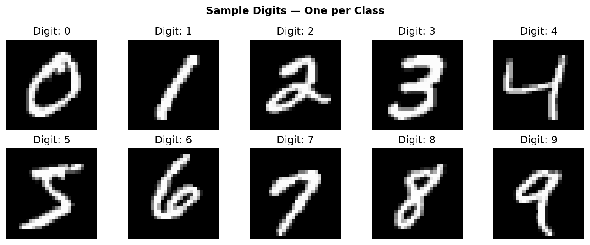
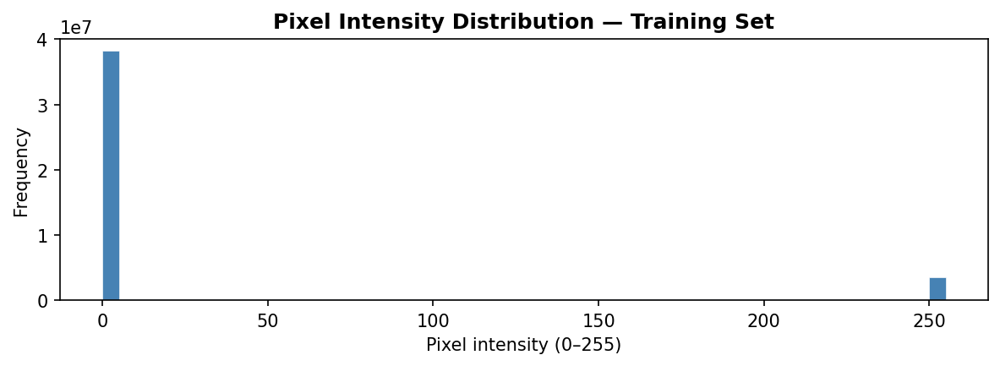
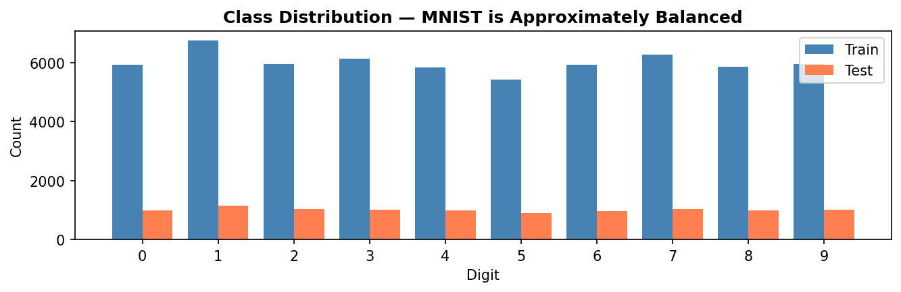
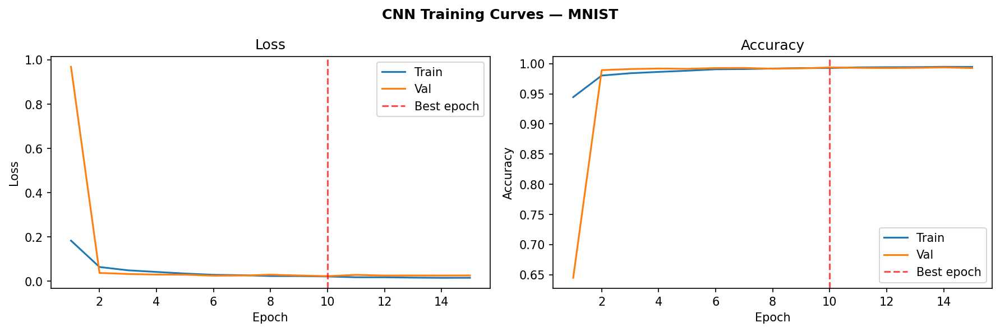
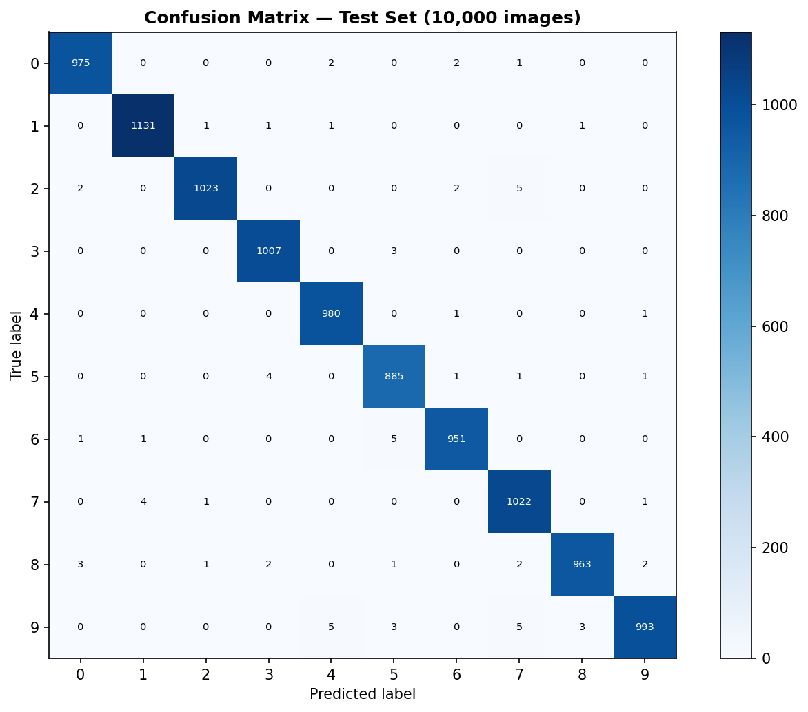
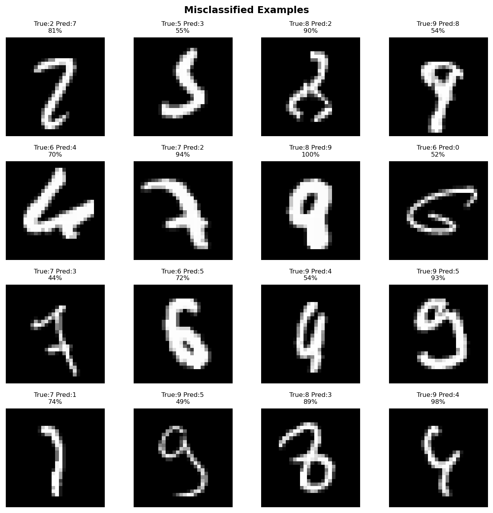

# digit-recognizer

Draw a digit. The model tells you what it is.

A convolutional neural network trained on 60,000 MNIST handwritten digit images.
The demo is the product: an HTML canvas where you draw with your mouse or finger
and the model returns the predicted digit, confidence score, and a probability
bar chart across all 10 digits in real time.

**Live demo → [digit-recognizer-xoc.azurewebsites.net](https://digit-recognizer-xoc.azurewebsites.net)**
&nbsp;&nbsp;·&nbsp;&nbsp;
**API docs → [/docs](https://digit-recognizer-xoc.azurewebsites.net/docs)**
&nbsp;&nbsp;·&nbsp;&nbsp;
**Notebook → notebook.ipynb**


---

## 0. Prerequisites

- Python 3.11+
- `pip` (or a virtual environment manager)

For training: TensorFlow with GPU/MPS acceleration recommended (Apple M1/M2 with `tensorflow-metal`, or CUDA GPU).

---

## 1. Quick start

```bash
git clone https://github.com/xavier-oc-programming/digit-recognizer
cd digit-recognizer
python -m venv venv && source venv/bin/activate
pip install -r requirements.txt

# Train the model (produces models/cnn_best.keras and plots/)
python train.py

# Start the API
uvicorn main:app --reload
# → http://localhost:8000
```

---

## 2. Project structure

```
digit-recognizer/
├── config.py                    # Single source of truth for all constants
├── train.py                     # Standalone training script — python train.py
├── main.py                      # FastAPI application
├── Dockerfile                   # Container definition
├── startup.txt                  # Azure App Service startup command
├── notebook.ipynb               # Full training walkthrough
├── README.md
├── requirements.txt
├── portfolio.yaml               # Portfolio metadata
├── .gitignore
├── .github/
│   └── workflows/
│       └── ci.yml               # GitHub Actions CI
├── templates/
│   └── index.html               # Canvas demo frontend
├── tests/
│   └── test_api.py              # pytest API tests
├── models/
│   ├── cnn_best.keras           # Trained model (committed)
│   ├── training_history.json    # Loss/accuracy per epoch
│   └── model_metrics.json       # Final test accuracy, per-class metrics
└── plots/
    ├── 01_sample_digits.png
    ├── 02_pixel_distribution.png
    ├── 03_class_distribution.png
    ├── 04_training_curves.png
    ├── 05_confusion_matrix.png
    └── 06_misclassified.png
```

---

## 3. Model architecture

Two convolutional blocks followed by a dense classifier.

| Layer | Output shape | Purpose |
|---|---|---|
| Conv2D(32, 3×3, relu) | 28×28×32 | 32 feature detectors — edges, curves, corners |
| BatchNormalization | 28×28×32 | Normalises activations, stabilises training |
| Conv2D(32, 3×3, relu) | 28×28×32 | Deeper feature detection within block 1 |
| MaxPooling2D(2×2) | 14×14×32 | Spatial reduction, translation invariance |
| Dropout(0.25) | 14×14×32 | Prevents co-adaptation, reduces overfitting |
| Conv2D(64, 3×3, relu) | 14×14×64 | 64 higher-level feature detectors |
| BatchNormalization | 14×14×64 | Stabilises deeper layers |
| Conv2D(64, 3×3, relu) | 14×14×64 | Deeper detection within block 2 |
| MaxPooling2D(2×2) | 7×7×64 | Second spatial reduction |
| Dropout(0.25) | 7×7×64 | Regularisation |
| Flatten | 3136 | 2D feature maps → 1D vector |
| Dense(512, relu) | 512 | Non-linear combinations of extracted features |
| BatchNormalization | 512 | Stabilises pre-final layer |
| Dropout(0.5) | 512 | Heaviest regularisation before output |
| Dense(10, softmax) | 10 | Probability distribution over 10 digit classes |

**Optimizer:** Adam &nbsp;·&nbsp; **Loss:** categorical crossentropy &nbsp;·&nbsp; **Metric:** accuracy

---

## 4. The canvas preprocessing challenge

This is the most important step in the entire inference pipeline.

**The problem:** MNIST images are white digits on a black background. The HTML canvas draws black digits on a white background — the exact opposite.

**The effect:** Without correction, the model receives an inverted input relative to everything it saw during training. It produces confident wrong predictions on every single drawing, with no error or warning.

**The fix:** After normalising canvas pixel values to [0, 1], invert them:

```python
image_array = 1.0 - image_array
```

One line. But finding it requires knowing that the mismatch exists.

The full preprocessing pipeline (which must exactly mirror training):
1. Decode base64 PNG → PIL Image
2. Convert to grayscale (`'L'`)
3. Resize from 280×280 to 28×28 using LANCZOS resampling
4. Convert to float32 NumPy array
5. Normalise to [0, 1] by dividing by 255
6. **Invert: `1.0 - pixel`** (MNIST convention)
7. Reshape to (1, 28, 28, 1) for batch + channel dimensions

---

## 5. Results

| Metric | Value |
|---|---|
| Test accuracy | **99.30%** |
| Test loss | 0.0199 |
| Best epoch | 8 / 20 (EarlyStopping) |
| Baseline (random) | 10.0% |

**Per-class F1 scores** — all digits above 98.9%:

| Digit | Precision | Recall | F1 |
|---|---|---|---|
| 0 | 99.4% | 99.5% | 99.4% |
| 1 | 99.6% | 99.6% | 99.6% |
| 2 | 99.7% | 99.1% | 99.4% |
| 3 | 99.3% | 99.7% | 99.5% |
| 4 | 99.2% | 99.8% | 99.5% |
| 5 | 98.7% | 99.2% | 98.9% |
| 6 | 99.4% | 99.3% | 99.3% |
| 7 | 98.6% | 99.4% | 99.0% |
| 8 | 99.6% | 98.9% | 99.2% |
| 9 | 99.5% | 98.4% | 99.0% |

Hardest digit pairs: **9→4** (9s with closed loops misread as 4), **7→1** (7s without crossbars misread as 1), **5→8** (5s with closed tops misread as 8). These are the same ambiguities that confuse humans.

---

## 6. Visualisations

**Sample digits**


**Pixel intensity distribution**


**Class distribution**


**Training curves**


**Confusion matrix**


**Misclassified examples**


---

## 7. API Reference

**POST /predict**

```json
// Request
{
  "image_data": "<base64-encoded PNG>"
}

// Response
{
  "digit": 7,
  "confidence": 0.982,
  "confidence_pct": 98,
  "is_uncertain": false,
  "probabilities": [0.001, 0.002, 0.001, 0.003, 0.001, 0.001, 0.001, 0.982, 0.005, 0.003],
  "top3": [
    {"digit": 7, "confidence": 0.982, "confidence_pct": 98},
    {"digit": 9, "confidence": 0.005, "confidence_pct": 0},
    {"digit": 3, "confidence": 0.003, "confidence_pct": 0}
  ]
}
```

**GET /health**
```json
{"status": "ok", "model_loaded": true, "model_accuracy": 0.9924}
```

**GET /api/model-info** — returns `model_metrics.json`

**GET /api/training-history** — returns `training_history.json`

**GET /docs** — auto-generated OpenAPI documentation

---

## 8. Deployment — Azure App Service

```bash
az group create --name digit-recognizer-rg --location westeurope
az appservice plan create --name digit-recognizer-plan \
  --resource-group digit-recognizer-rg --sku B1 --is-linux
# Scale to F1 free tier via portal after creation
az webapp create --name digit-recognizer-xoc \
  --resource-group digit-recognizer-rg \
  --plan digit-recognizer-plan --runtime "PYTHON:3.11"
az webapp config set --name digit-recognizer-xoc \
  --resource-group digit-recognizer-rg \
  --startup-file "gunicorn main:app --workers 1 --worker-class uvicorn.workers.UvicornWorker --bind 0.0.0.0:8000 --timeout 600"
az webapp config appsettings set --name digit-recognizer-xoc \
  --resource-group digit-recognizer-rg \
  --settings SCM_DO_BUILD_DURING_DEPLOYMENT=true
cd digit-recognizer && zip -r deploy.zip . \
  -x "*.git*" -x "venv/*" -x "__pycache__/*" -x "*.ipynb_checkpoints*"
az webapp deployment source config-zip \
  --name digit-recognizer-xoc \
  --resource-group digit-recognizer-rg \
  --src deploy.zip
```

The trained model (`models/cnn_best.keras`) is committed to the repository, so Azure loads it without retraining. Startup is fast — the model loads in under 2 seconds.

---

## 9. CI/CD

GitHub Actions runs pytest on every push to `main`. The model file is committed so tests can load it without training.

```bash
pytest tests/ -v
```

---

## 10. Design decisions

**Why CNN over a fully connected network for images**

A dense network treats each pixel independently and has no concept of spatial structure. A 7 drawn in the top-left corner and a 7 drawn in the centre are completely different inputs to a dense layer — the weight connecting pixel (3,3) to a neuron is entirely unrelated to the weight connecting pixel (15,15). Convolutions solve this by learning feature detectors that slide across the entire image: the same edge detector fires whether the edge is at (3,3) or (15,15). This translation invariance is why CNNs are the standard architecture for image classification.

**Why two conv blocks rather than one or three**

One block is too shallow — the model learns low-level features (edges, curves) but cannot combine them into higher-level patterns (strokes, loops). Three blocks on 28×28 images causes the spatial dimensions to collapse too aggressively after MaxPooling, leaving insufficient feature map resolution for the classifier. Two blocks strikes the right balance for this input size: the first block learns edge detectors, the second combines them into digit-level patterns.

**Why BatchNormalization alongside Dropout**

Dropout and BatchNorm address different failure modes. Dropout prevents co-adaptation — neurons learning to rely on specific other neurons rather than developing independent features. BatchNorm prevents internal covariate shift — the distribution of each layer's inputs changing during training, which forces subsequent layers to continuously readapt. Using both produces faster, more stable convergence. The only caveat is ordering: BatchNorm before Dropout is the standard convention, which is what this architecture follows.

**Why the canvas inversion step is critical**

Described in full in section 4. The short version: MNIST convention is white strokes on black; human convention is black strokes on white. The mismatch produces a silent failure — no exception, no warning, just confident wrong predictions on every input. The fix is one line but requires knowing both the training data format and the inference input format. This is the canonical example of a preprocessing divergence bug.

**Why FastAPI over Flask for this project**

The canvas sends a base64-encoded PNG via `fetch()` to `POST /predict`. FastAPI validates the request body automatically via Pydantic, generates OpenAPI documentation at `/docs` without any extra code, and its ASGI architecture handles concurrent prediction requests without blocking. The consistency with other projects in this portfolio (credit-risk-scorer, cv-gap-analyser) also matters — using FastAPI across multiple projects signals a deliberate architectural choice rather than a one-off experiment.

---

## 11. Dependencies

| Package | Version | Purpose |
|---|---|---|
| tensorflow | ≥2.15 | CNN training and inference |
| numpy | ≥1.24, <2.0 | Array operations, preprocessing |
| pandas | ≥2.0 | Data handling |
| scikit-learn | ≥1.3 | Classification report, confusion matrix |
| matplotlib | ≥3.7 | Training plots |
| pillow | ≥10.0 | Image decoding for inference |
| fastapi | ≥0.110 | REST API |
| uvicorn | ≥0.27 | ASGI server |
| gunicorn | ≥21.0 | Process manager for Azure |
| pydantic | ≥2.0 | Request/response validation |
| jinja2 | ≥3.1 | HTML template rendering |
| jupyter | ≥1.0 | Notebook walkthrough |
| pytest | ≥7.0 | API tests |
| httpx | ≥0.27 | pytest HTTP client |
| python-multipart | ≥0.0.9 | Form data parsing |
